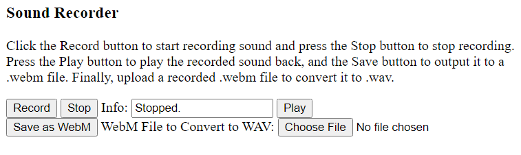

SoundRecorder
=============

A sound recorder implemented in JavaScript.

Currently it records in the WebM/Opus format, because browsers make that much relatively easy, but it would of course be more useful if the audio were available in a more widely supported format, like WAV.  Unfortunately, that is much more difficult to accomplish.  Functionality to convert a recorded WebM file to a WAV file has been added, but it is only in the experimental phase.  The outputted WAV only lasts a couple of seconds, and currently the audio is very noisy after the conversion.

 
